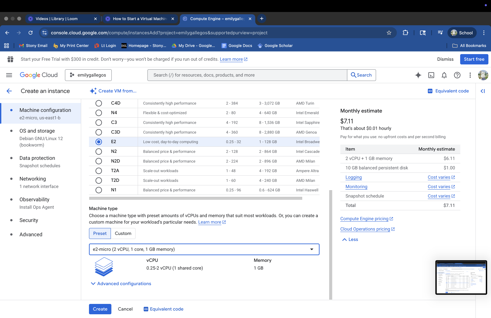

# VM Lifecycle on GCP and Azure — Tutorial

## Video
Loom [video](https://www.loom.com/share/efb30890372d47b3b0bbaa68b5f64713?sid=4d457d6b-9b79-48df-8594-ac1e97da1143) of me going through GCP and Azure :)   

## Prereqs
- Cloud access to GCP and Microsoft Azure
- No PHI/PII; smallest/free-tier shapes

---

## Google Cloud (GCP)
### Create
1. Console → Compute Engine → Create instance
2. Region/zone: us-east1/ us-east1-b
3. Machine type: e2-micro (2 vCPU, 1 core, 1GB memory)
4. Image: Ubuntu 25.04 Minimal
5. Boot disk: default minimal
6. Network: default VPC; ephemeral public IP

### Start/Stop
- Start: 

- Stop: 

### Delete
- Delete instance and verify no disks/IPs remain

---

## Microsoft Azure 
### Create
1. Hamburger -> Virtual Machines -> Create
2. Region/Availibility Zone: (US) East US/Zone 3
3. Machine size: Standard_B1ls - 1 vcpu, 0.5 GiB memory
4. Image: Ubuntu Server 24.04 LTS -64x Gen2
5. Authentication type: Password
6. Boot volume: default minimal

### Start/Stop
- Start: 

- Stop: <state shows STOPPED>

### Terminate
- Terminate and delete boot volume; verify cleanup

---

## Reflections

### Similarities
- The user interface on both platforms was fairly easy to navigate.
- Both VMs had multiple computers and OS systems to choose from, which can help with cost optimization.
- Easy to delete the VMs.
- Clearly state the status of the computer.
- Computer information is easy to read.

### Differences
- GCP's home menu is very basic and requires you to click on the hamburger to navigate to the virtual machine tab. Azure's home menu features the virtual machine option prominently, simplifying the need to navigate to it.
-  The operating system customization was separated from the computer customization on GCP.
- Azure gave the option to password-protect the computer during the creation process.
- GCP's SSH button is easily accessible and easy to find.

### Preference (Azure vs GCP) and Why
- Microsoft Azure has my vote because the steps to create a very basic VM (virtual machine) were very simple and easy. I like the flow for creating the VM. With GCP, I think I would forget to adjust the OS system and change it to Ubuntu or a different OS system since the section to customize is off to the side. With Azure, it made me select the OS/Image as part of the initial create steps. I also like that the Azure interface gave me a view of the 'start', 'stop', and 'delete' buttons. With the GCP interface, I had to look for them, and while it wasn't difficult to find, I do find that they are a bit more hidden. I felt as though the steps to create a VM in Azure were faster than the steps for GCP, which can be seen when watching the videos. GCP took about 6 minutes, close to 7, in comparison to Azure, which took about 4 minutes. In addition to creating the VM faster, Azure was quicker to stop and delete the VM than GCP, and did not leave me questioning whether everything was genuinely shut down.